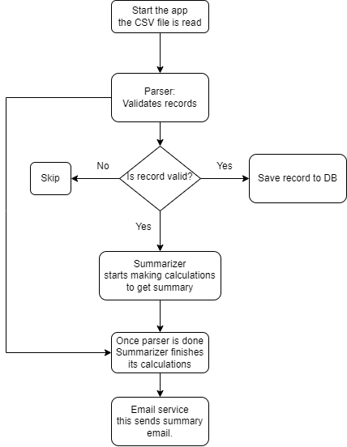

# Stori Bank CSV Parser

## Introduction

Stori Bank CSV Parser is a Golang application designed for parsing financial transactions from CSV files, calculating summaries, and storing the parsed transactions along with aggregated summaries in a PostgreSQL database.

## Features

- **CSV Parsing:** Efficiently parses CSV data containing financial transactions.
  
- **Summaries Calculation:** Calculates average credit, average debit, total balance, and the number of transactions per month.

- **Database Integration:** Stores individual transactions and summaries in a PostgreSQL database.

- **Docker Compose:** Easily deploy the application using Docker Compose.

## Installation and Usage

1. Clone the repository:

   ```bash
   git clone https://github.com/Dukler/ChallengeStori.git
   cd ChallengeStori
   ```
2. Run the application using Docker Compose:

   ```bash
   docker-compose up
   ```

## Database Schema

The application uses a PostgreSQL database with the following schema:

- **Transactions:**
  - `id`: Unique identifier for the transaction.
  - `execution_id`: Execution ID of the transaction.
  - `external_id`: External ID of the transaction (id from CSV).
  - `value`: Transaction amount (positive for credit, negative for debit).
  - `date`: Date of the transaction.
  - `created_at`: Timestamp when the transaction was created.

- **Summaries:**
  - `execution_id`: Execution ID of the summary.
  - `average_credit`: Average credit amount for the summary.
  - `average_debit`: Average debit amount for the summary.
  - `balance`: Total balance for the summary.
  - `monthly_transactions`: Number of transactions per month in the summary.
  - `created_at`: Timestamp when the summary was created.

## Possible Improvements

### Adding a Timeout for Shutdown

Implement a timeout mechanism to close the application gracefully in case of an unforeseen error. This ensures that the application doesn't hang indefinitely.

### Handling Errors in Transaction Processing

Considering not sending the summary mail if an error occurs during transaction processing. In such a case a continuation mechanism where only transactions with errors are processed in subsequent runs could be useful.


## Diagram explanation
